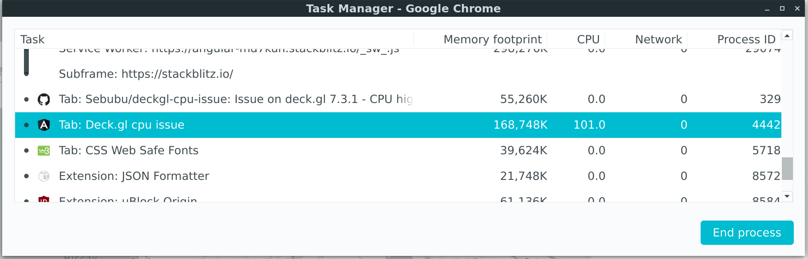
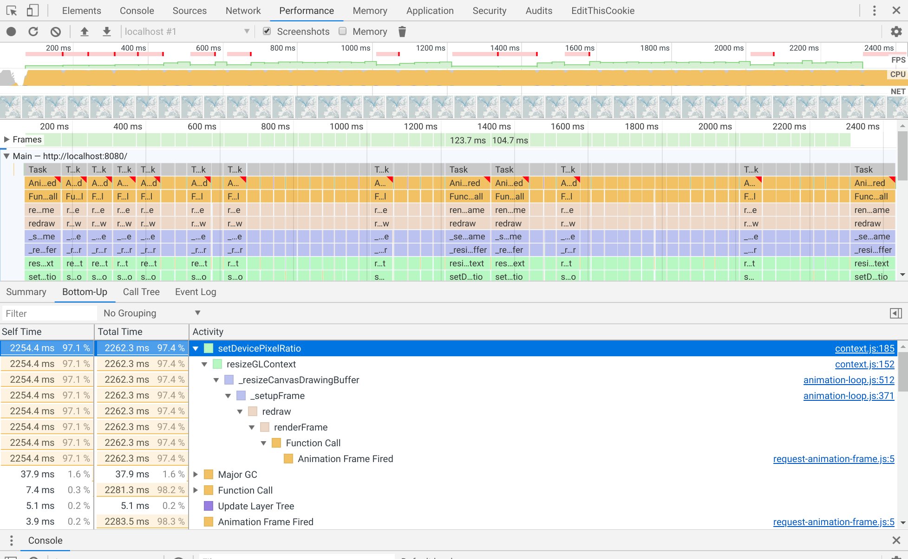
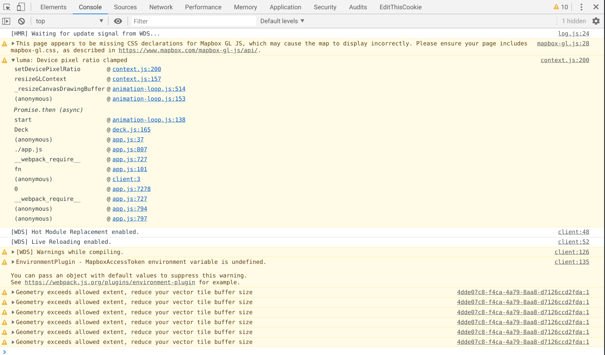

# Deck.gl cpu issue


### Issue
As soon as deck is initialized, the cpu will raise to 70% and more.

### Run project

1. Set the mapbox access token on `app.component.ts` on line 5.
2. Install dependencies and run Angular.

```bash
npm install
ng serve
```

### Screenshots




### Packages

- deck.gl: 7.3.1
- mapbox-gl: 1.4.0
- Angular: 8.2.8
- Angular cli: 8.3.6
